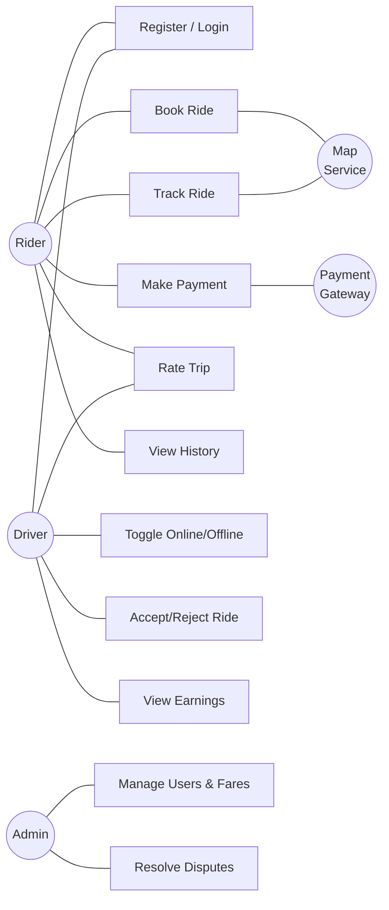
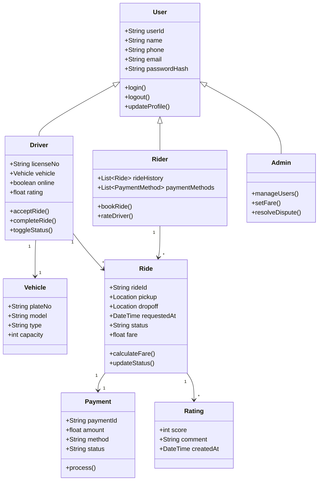
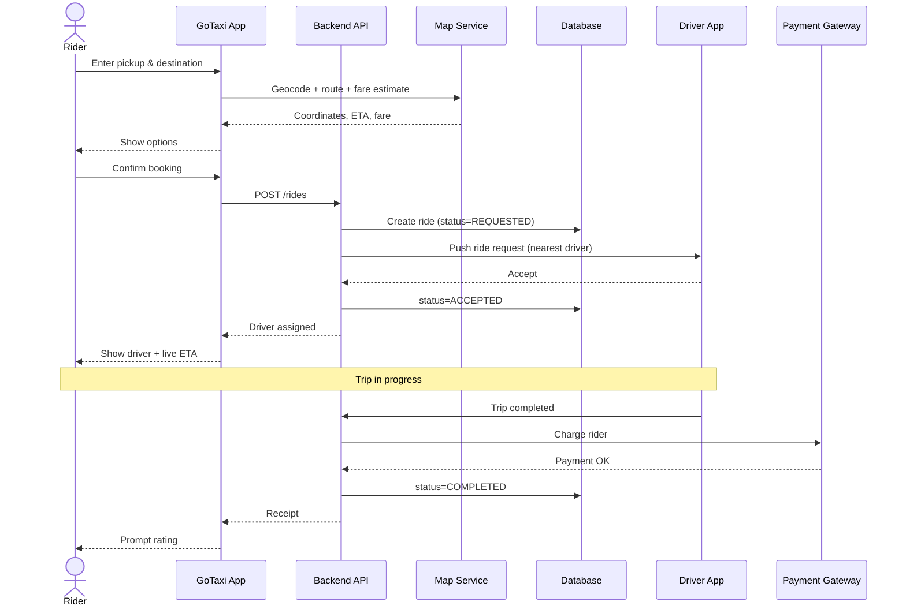
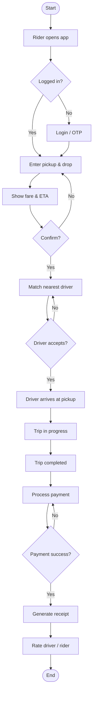
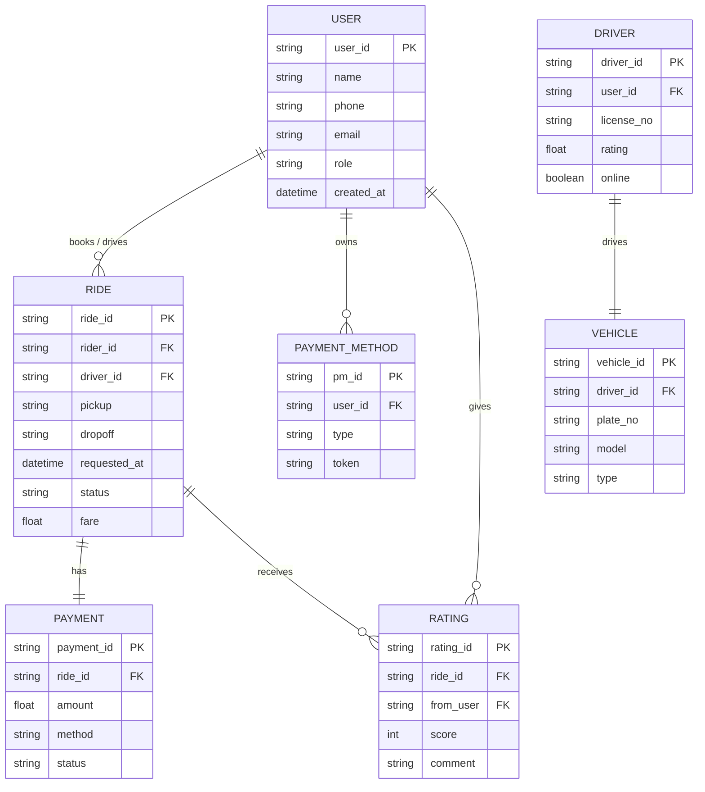
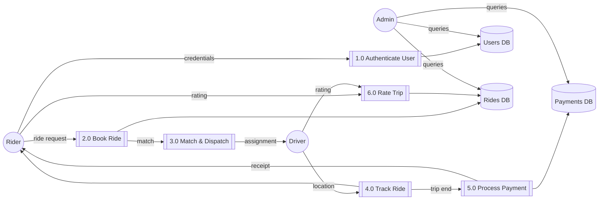
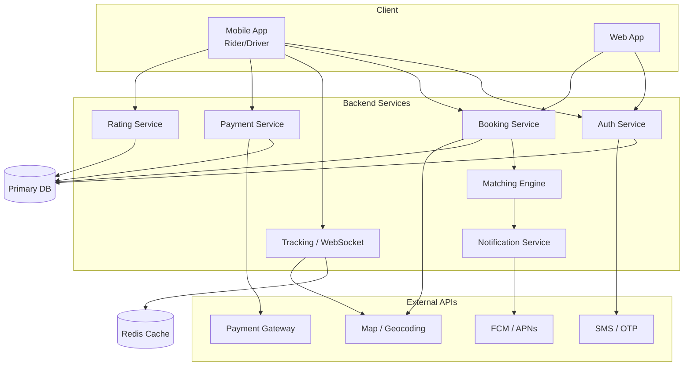
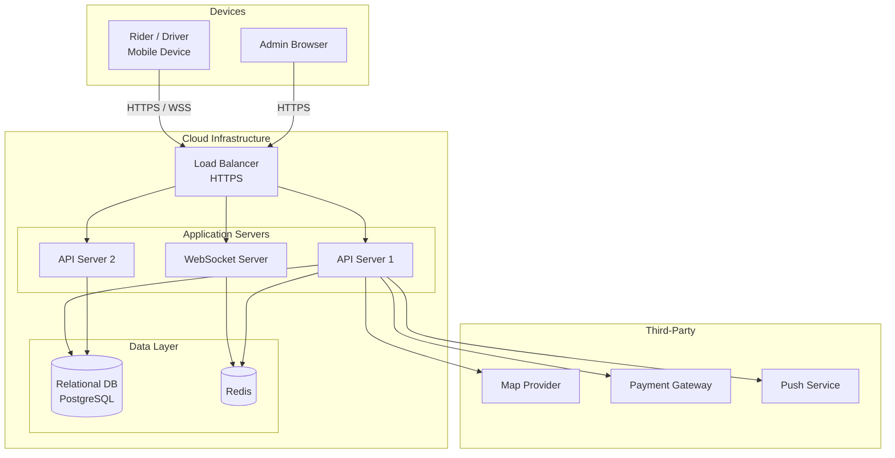

# Software Requirements Specification (SRS)
## GoTaxi — Cab Hailing Application

**Version:** 1.0
**Date:** 2026-05-01
**Prepared for:** GoTaxi Project

---

## Table of Contents
1. [Introduction](#1-introduction)
2. [Overall Description](#2-overall-description)
3. [Specific Requirements](#3-specific-requirements)
4. [External Interface Requirements](#4-external-interface-requirements)
5. [Non-Functional Requirements](#5-non-functional-requirements)
6. [System Diagrams](#6-system-diagrams)

---

## 1. Introduction

### 1.1 Purpose
This Software Requirements Specification (SRS) describes the functional and non-functional requirements of **GoTaxi**, a cab-hailing application that connects passengers (riders) with drivers in real time. This document is intended for developers, designers, project managers, testers, and stakeholders.

### 1.2 Scope
GoTaxi is a multi-platform mobility application enabling users to:
- Book on-demand or scheduled rides
- Track drivers in real time
- Make cashless payments
- Rate trips and view ride history
- Allow drivers to accept rides, manage trips, and view earnings

The system serves three primary actors: **Rider**, **Driver**, and **Administrator**.

### 1.3 Definitions, Acronyms, Abbreviations
| Term | Meaning |
|------|---------|
| SRS  | Software Requirements Specification |
| ETA  | Estimated Time of Arrival |
| OTP  | One-Time Password |
| GPS  | Global Positioning System |
| UI/UX | User Interface / User Experience |
| API  | Application Programming Interface |

### 1.4 References
- IEEE 830-1998: Recommended Practice for Software Requirements Specifications
- GoTaxi Figma & Stitch design prototypes
- Project repository `README.md`

### 1.5 Overview
Section 2 gives an overall description of the product. Section 3 details specific functional requirements. Section 4 describes interfaces. Section 5 captures non-functional requirements. Section 6 contains the required diagrams (Use Case, Class, Sequence, Activity, ER, DFD, Component, Deployment).

---

## 2. Overall Description

### 2.1 Product Perspective
GoTaxi is a self-contained product with mobile and web clients backed by a cloud service. It integrates with third-party services for maps, payments, and SMS/OTP.

### 2.2 Product Features (high level)
- User registration and authentication (OTP-based)
- Location search and ride booking
- Real-time driver matching and tracking
- In-app payment (card, wallet, cash)
- Trip rating and feedback
- Driver dashboard (online/offline, accept/reject, earnings)
- Admin oversight (users, drivers, fares, disputes)

### 2.3 User Classes and Characteristics
| Actor | Description |
|-------|-------------|
| Rider | End user booking rides via the app |
| Driver | Vehicle operator fulfilling ride requests |
| Admin | Operations staff managing users, fares and disputes |
| Payment Gateway | External system processing transactions |
| Map Provider | External GPS/geocoding service |

### 2.4 Operating Environment
- Mobile: Android 9+, iOS 14+
- Web: Modern browsers (Chrome, Safari, Firefox, Edge — last 2 versions)
- Backend: Cloud-hosted (Linux), REST/HTTPS, WebSocket for live tracking

### 2.5 Design and Implementation Constraints
- Tailwind CSS / Material-style design language
- Real-time updates require WebSocket or push notifications
- Compliance with local transportation regulations
- All communications over TLS

### 2.6 Assumptions and Dependencies
- Users have internet connectivity and GPS-enabled devices
- A third-party map service is available
- A payment gateway provider is integrated

---

## 3. Specific Requirements

### 3.1 Functional Requirements

#### FR-1: User Registration & Login
- **FR-1.1** The system shall allow a new user to register using phone number and OTP verification.
- **FR-1.2** The system shall support login via OTP or saved session token.
- **FR-1.3** The system shall allow profile editing (name, photo, email, payment methods).

#### FR-2: Ride Booking
- **FR-2.1** The system shall allow a rider to enter pickup and drop-off locations using map search.
- **FR-2.2** The system shall display available ride classes (Economy, Premium, XL) with fare estimates and ETAs.
- **FR-2.3** The system shall allow a rider to confirm a booking and select payment method.
- **FR-2.4** The system shall match the request to the nearest available driver.
- **FR-2.5** The system shall support scheduled rides for a future date/time.

#### FR-3: Real-Time Tracking
- **FR-3.1** The system shall display the assigned driver's live location on a map.
- **FR-3.2** The system shall show ETA, vehicle details, and driver name/rating.
- **FR-3.3** The system shall allow the rider to share trip status with a contact.

#### FR-4: Payment
- **FR-4.1** The system shall support cash, credit/debit card, and in-app wallet.
- **FR-4.2** The system shall generate a fare receipt at trip completion.
- **FR-4.3** The system shall apply promo codes/discounts when valid.

#### FR-5: Ratings & Feedback
- **FR-5.1** The system shall prompt rider and driver to rate each other (1–5 stars) after every trip.
- **FR-5.2** The system shall allow optional written feedback.

#### FR-6: Driver Module
- **FR-6.1** The system shall let drivers toggle online/offline status.
- **FR-6.2** The system shall notify drivers of incoming ride requests with accept/reject options (timeout based).
- **FR-6.3** The system shall display daily/weekly earnings and trip activity.

#### FR-7: Notifications
- **FR-7.1** The system shall send push/SMS notifications for booking confirmations, driver arrival, and payment receipts.

#### FR-8: Admin
- **FR-8.1** The system shall allow admins to manage user/driver accounts, fares, promotions, and disputes.

### 3.2 Non-Functional Requirements
See [Section 5](#5-non-functional-requirements).

---

## 4. External Interface Requirements

### 4.1 User Interfaces
- Mobile-first responsive UI
- Screens: Splash, Login/OTP, Home, Booking, Tracking, Payment, Rating, Profile, Activity/History, Driver Dashboard

### 4.2 Hardware Interfaces
- GPS sensor for location services
- Camera (driver/vehicle verification, profile photos)

### 4.3 Software Interfaces
- Map/Geocoding API (e.g., Google Maps / Mapbox)
- Payment Gateway API (e.g., Stripe / local processor)
- SMS gateway for OTP
- Push notification service (FCM / APNs)

### 4.4 Communication Interfaces
- HTTPS REST APIs
- WebSocket for real-time tracking
- TLS 1.2+ encryption

---

## 5. Non-Functional Requirements

| Category | Requirement |
|----------|-------------|
| Performance | Booking request matched within ≤ 5 seconds under normal load |
| Scalability | Support 10,000 concurrent active users in pilot phase |
| Availability | 99.5% uptime monthly |
| Security | TLS in transit, AES-256 at rest, OWASP Top 10 mitigations, OTP-based auth |
| Usability | First-time booking achievable in ≤ 3 taps from home screen |
| Reliability | Graceful retry on network loss; no double charges |
| Maintainability | Modular code (CSS, JS modules already separated) |
| Portability | Works on Android, iOS, modern desktop browsers |

---

## 6. System Diagrams

> Diagrams below use Mermaid syntax. Render with any Mermaid-compatible viewer (GitHub, VS Code Mermaid Preview, mermaid.live).

### 6.1 Use Case Diagram

### 6.2 Class Diagram

### 6.3 Sequence Diagram — Book a Ride

### 6.4 Activity Diagram — Ride Lifecycle

### 6.5 Entity Relationship (ER) Diagram

### 6.6 Data Flow Diagram (Level 1)

### 6.7 Component Diagram

### 6.8 Deployment Diagram

---

## Appendix A — Traceability Summary
| Requirement | Use Case | Module |
|-------------|----------|--------|
| FR-1 | Register/Login | Auth Service |
| FR-2 | Book Ride | Booking Service |
| FR-3 | Track Ride | Tracking Service |
| FR-4 | Make Payment | Payment Service |
| FR-5 | Rate Trip | Rating Service |
| FR-6 | Driver Dashboard | Driver Module |
| FR-7 | Notifications | Notification Service |
| FR-8 | Admin Ops | Admin Console |

---

*End of Document.*
